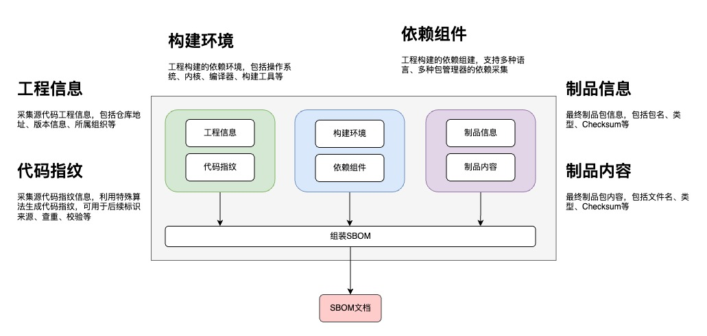

# SBOM-TOOL
English | [简体中文](./README_zh.md)

SBOM-TOOL is a ctl tool that generates software bill of materials (SBOM) for software projects through source code warehouse, code fingerprint, construction environment, artifact information, artifact content, dependency construction and other dimensional information.
## Feature

### Information collection
- Collect source code engineering information, including warehouse address, version information, etc.
- Collect and generate code fingerprints
- Collecting engineering construction depends on environmental information
- Collect the dependent components built by the project
- Collect the final artifact package information
- Collect artifact content information, including file name type, check code, etc.
### SBOM document
- Assemble SBOM documents
- Standard format conversion，support domestic XSPDX, SPDX and other specifications, support JSON, TagValue and other formats
- Canonical format check，support domestic XSPDX, SPDX and other specifications, support JSON, TagValue and other formats

## Code fingerprint generation ability

| language      | Is it supported|
|---------------|---------------------|
| `C/C++`       | yes                 | 
| `Java`        | yes                 | 
| `C#`          | yes                 | 
| `Dart`        | yes                 | 
| `Golang`      | yes                 | 
| `Javascript`  | yes                 | 
| `Objective-C` | yes                 | 
| `Php`         | yes                 | 
| `Python`      | yes                 | 
| `Ruby`        | yes                 | 
| `Rust`        | yes                 | 
| `Swift`       | yes                 | 
| `Lua`         | yes                 |


## Dependent packet scanning capability
Configuration file parsing and binary package parsing related to the following programming languages are now supported, and more programming languages will be supported step by step.

| Package Type | Package Manager                                  | Parsing file                                                                                                                                                                                                                  | support dependency graph |
|--------------|--------------------------------------------------|-------------------------------------------------------------------------------------------------------------------------------------------------------------------------------------------------------------------------------|--------------------------|
| `maven`      | [Maven](https://maven.apache.org)                | <ul><li>`pom.xml`</li> <li>`*.jar`</li> <li>`*.war`</li><li>`[graph]maven-dependency-tree.txt(mvn dependency:tree -DoutputFile=maven-dependency-tree.txt)`</li></ul>                                                          | yes                      |
| `maven`      | [Gradle](https://gradle.org)                     | <ul><li>`*.gradle`</li>  <li>`.gradle.lockfile`</li> <li>`[graph]gradle-dependency-tree.txt(gradlew gradle-baseline-java:dependencies > gradle-dependency-tree.txt)`</li></ul>                                                | yes                      |
| `conan`      | [Conan](https://conan.io)                        | <ul><li>`conanfile.txt`</li> <li>`conan.lock`</li><li>`[graph]conan-graph-info.json(conan graph info -f json > conan-graph-info.json)`</li></ul>                                                                              | yes                      |
| `npm`        | [NPM](https://www.npmjs.com)                     | <ul><li>`package.json`</li> <li>`package-lock.json`</li></ul>                                                                                                                                                                 | no                       |
| `npm`        | [Yarn](https://yarnpkg.com)                      | <ul><li>`[graph]yarn.lock`</li></ul>                                                                                                                                                                                          | yes                      |
| `npm`        | [PNPM](https://pnpm.io/)                      | <ul><li>`[graph]pnpm.lock`</li></ul>                                                                                                                                                                                          | yes                      |
| `golang`     | [Go Module](https://go.dev/ref/mod)              | <ul><li>`go.mod`</li>  <li>`Go Binary file`</li> <li>`[graph]go-mod-graph.txt(go mod graph > go-mod-graph.txt)` </li></ul>                                                                                                    | yes                      |
| `golang`     | [Glide](https://github.com/Masterminds/glide)    | <ul><li>`glide.yml`</li> <li>`glide.yaml`</li></ul>                                                                                                                                                                           | no                       |
| `golang`     | [GoDep](https://github.com/tools/godep)          | <ul><li>`Godeps.json`  </li></ul>                                                                                                                                                                                             | no                       |
| `golang`     | [Dep](https://github.com/golang/dep)             | <ul><li>`Gopkg.toml` </li></ul>                                                                                                                                                                                               | no                       |
| `golang`     | [GVT](https://github.com/FiloSottile/gvt)        | <ul><li>`*/vendor/manifest`</li></ul>                                                                                                                                                                                         | no                       |
| `pypi`       | [PIP](https://pip.pypa.io)                       | <ul><li>`Pipfile.lock`</li>  <li>`*dist-info/METADATA`</li> <li>`PKG-INFO`</li> <li>`*requirements*.txt`</li> <li>`setup.py` </li><li>`[graph]pipenv-graph.txt(pipenv graph > pipenv-graph.txt)`</li></ul>                    | yes                      |
| `pypi`       | [Poetry](https://python-poetry.org)              | <ul><li>`[graph]poetry.lock`</li></ul>                                                                                                                                                                                        | yes                      |
| `conda`      | [Conda](https://conda.io)                        | <ul><li>`environment.yml`</li> <li>`environment.yaml`</li> <li>`package-list.txt`</li></ul>                                                                                                                                   | no                       |
| `composer`   | [Composer](https://getcomposer.org)              | <ul><li>`composer.json`</li> <li>`composer.lock`</li></ul>                                                                                                                                                                    | no                       |
| `cargo`      | [Cargo](https://doc.rust-lang.org/cargo)         | <ul><li>`Cargo.toml`</li> <li>`[graph]Cargo.lock`</li> <li>`Rust Binary file`</li></ul>                                                                                                                                              | yes                      |
| `carthage`   | [Carthage](https://github.com/Carthage/Carthage) | <ul><li>`Cartfile`</li>   <li>`Cartfile.resolved`</li></ul>                                                                                                                                                                   | no                       |
| `swift`      | [SwiftPM](https://www.swift.org/package-manager) | <ul><li>`Package.swift`</li></ul>                                                                                                                                                                                             | no                       |
| `cocoapods`  | [Cocoapods](https://cocoapods.org)               | <ul><li>`Podfile.lock`</li><li>`Podfile`</li> <li>`*.podspec`</li></ul>                                                                                                                                                       | yes                      |
| `gem`        | [Gem](https://rubygems.org)                      | <ul><li> `[graph]Gemfile.lock`</li><li>`Gemfile`</li> <li>`*.gemspec`</li></ul>                                                                                                                                                      | yes                      |
| `nuget`      | [NuGet](https://www.nuget.org)                   | <ul><li>`[graph]*.deps.json`</li>   <li>`*.csproj`</li> <li>`*.vbproj`</li> <li>`*.fsproj`</li> <li>`*.vcproj`</li>  <li>`*.nuget.dgspec.json`</li> <li>`*.nuspec`</li> <li>`packages.json`</li> <li>`packages.lock.json` </li></ul> | yes                      |
| `pub`        | [Pub](https://pub.dev)                           | <ul><li>`[graph]pub-deps.json(dart pub deps --json > pub-deps.json)`</li>   <li>`pubspec.lock`</li> <li>`pubspec.yaml`</li></ul>                                                                                                           | yes                      |
| `rpm`        | [RPM](https://rpm-packaging-guide.github.io)     | <ul><li>`*.spec`</li></ul>                                                                                                                                                                                                    | no                       |
| `lua`        | [LuaRocks](https://luarocks.org)                 | <ul><li>`*.rockspec`</li></ul>                                                                                                                                                                                                | no                       |
| `bower`      | [Bower](https://bower.io)                        | <ul><li>`*.spec`</li></ul>                                                                                                                                                                                                    | no                       |


## Architecture



## Installation
1. Download source code compilation(`go 1.18` or above is required)
   ```shell
   git clone git@gitee.com:JD-opensource/sbom-tool.git
   cd sbom-tool
   make
   ```
   Generate program binaries for various system architectures by default
    - Linux X86_64：sbom-tool-linux-amd64
    - Linux arm64：sbom-tool-linux-arm64
    - Windows X86_64：sbom-tool-windows-amd64.exe
    - Windows arm64：sbom-tool-windows-arm64.exe
    - MacOS amd64:  sbom-tool-darwin-amd64
    - MacOS arm64: sbom-tool-darwin-arm64

## Subcommands


| subcommand    | function           |
|---------------|--------------------|
| `help`        | Help about any command           | 
| `artifact`    | collect artifact information        |
| `assembly`    |  assembly sbom document from document segments | 
| `completion`  | Generate the autocompletion script for the specified shell | 
| `convert`     | convert sbom document format       | 
| `env`         | build environment info| 
| `fingerprint` | generate code fingerprint            | 
| `generate`    | generate sbom document          |
| `package`     | collect package dependencies            | 
| `source`      | collect source code information           | 
| `validate`    | validate sbom document format        | 
| `info`        | get tool introduction information        | 
| `modify`        | modify sbom document properties| 

## Parameter description

|Parameters      | Short parameter  | describe                                                                                                                          | Use exampl                                        |
| --------- |------|-----------------------------------------------------------------------------------------------------------------------------------|---------------------------------------------|
| `--log-level `  |      | log level (`debug`、`info`、`warn`、`error`)                                                                                         | `--log-level info`                          |
| `--log-path `  |      | log output path (default "$home/sbom-tool/sbom-tool.log")                                                                         | `--log-path /tmp/sbom.log`                  |
| `--quiet  `  | `-q` | no console output                                                                                                                 | `--quiet`  </br>`-q`                        |
| `--ignore-dirs`   |      | dirs to ignore, skip all dot dirs, split by comma. sample: node_modules,logs                                                      | `--ignore-dirs log,logs`                    |
| `--language`  | `-l` | programming language (Currently supported:`java`，`cpp`)(Default “*”)                                                              | `--language java`  </br>`-l cpp`            |
| `--parallelism`  | `-m` | number of parallelism(Default `8`)                                                                                                | `--parallelism 4`  </br>`-m 9`              |
| `--output`  | `-o` | output file，The result file is produced in the current directory by default.                                                      | `--output /tmp/sbom.json`                   |
| `--src`  | `-s` | project source directory(use project root if empty) (default ".")                                                                 | `--src /tmp/sbomtool/src/`                  |
| `--path`  | `-p` | Specify the project project home directory; the assemble subcommand is used to specify the temporary document path for each phase | `--path /tmp/sbomtool/`                     |
| `--dist `  | `-d` | distribution directory  (default ".")                                                                                             | `--dist /tmp/sbomtool/bin/`                 |
| `--format`  | `-f` | Specify SBOM document format(Currently supported:`xspdx-json`、`spdx-json`、`spdx-tagvalue` )(Default `spdx-json`)                  | `--format xspdx-json`  </br>`-f spdx-json` |
| `--input`  | `-i` | Specify the SBOM document as input                                                                                                | `--input /tmp/sbom.jsom`                    |

## SBOM Document specification and format

| specification | format         | SBOM document format  | status  |
|:--------------|:-----------|:-----------------|:----|
| `XSPDX`       | `JSON`     | `xspdx-json`    | Supported |
| `SPDX`        | `JSON`     | `spdx-json`      | Supported |
| `SPDX`        | `TagValue` | `spdx-tagvalue`  | Supported |
## User guide
Generate code fingerprints only based on the source code path

```shell
sbom-tool fingerprint -m 4 -s ${src_path}  -o fingerprint.json --ignore-dirs .git
```

Generate an SBOM document and specify the format

```shell
sbom-tool generate -m 4 -p ${project_path} -s ${src_path} -d ${dist_path}  -o sbom.spdx.json -f spdx-json --ignore-dirs .git  -n ${name} -v ${version} -u ${supplier} -b ${namespace}
```

Get tool introduction information

```shell
sbom-tool info
```

See [document](docs/en-US/user-guide.md) for details.

## Development guide
See for details [Development guide documentation](docs/en-US/development-guide.md)

## Problem feedback & contact us
If you encounter problems in use, you are welcome to submit ISSUE to us.

## How to Contribute
SBOM-TOOL is a open source software component analysis tool, look forward to your contribution.

## License
This project is licensed under **MulanPSL2** - see the [LICENSE](LICENSE) file for details.